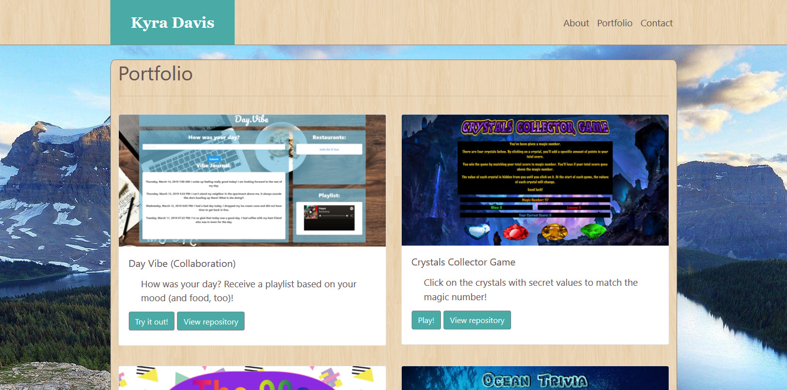

# Bootstrap-Portfolio

## Contributors

kd101jp14

## Technology

* HTML5
* CSS3
* Bootstrap 4

## Live demo:
https://kd101jp14.github.io/Bootstrap-Portfolio/

## About

This portfolio is a collection of 3 linked web pages (About, Portfolio, and Contact) and related files. They were created using HTML, CSS, and Bootstrap. The `About` page provides a little text about me and a link to my resume. The `Portfolio` page contains projects that I have created during my full stack coding boot camp at Vanderbilt University. The `Contact` page contains elements where visitor may submit his or her name, email, and a message.

### The Challenge
The challenge of making this portfolio began with learning how to utilize Bootstrap to create the page layouts. The portfolio prior to this project was created using strictly HTML and CSS. Although learning a new framework was challenging, it was also rewarding. Bootstrap allowed this project to be mobile-responsive with ease.

## Screenshot

## License

* This project does not have a license and is not currently open for contributions. Suggestions are welcome.

## Contact

* Homepage:  https://github.com/kd101jp14

* E-mail: davis.kyra@rocketmail.com
